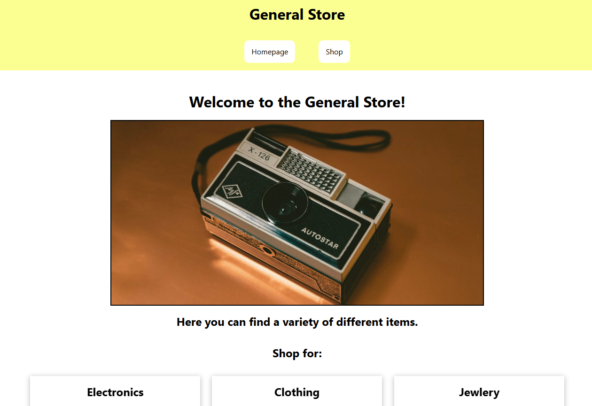

# Store

A mock store webpage made with React that lets you add items to a cart and then "buy" them.



## Installation

Simply clone the repo and run the commands below.

```powershell
  npm install
  npm run dev
```
